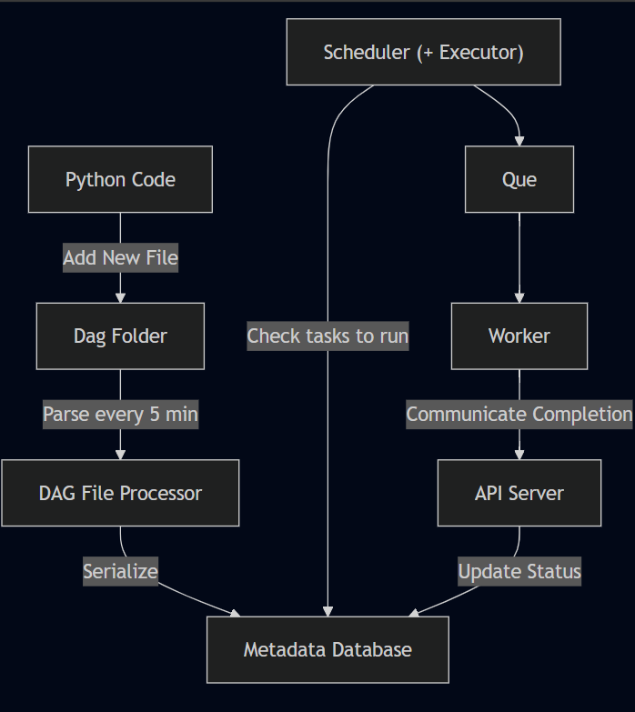

### How to Run?

**Create Virtual Env**

> uv venv --python 3.11

**Activate Environment**

> .venv\Scripts\activate

**Compose Docker**

> docker compose up

**How a task runs**

**Term Translations (Airflow -> ADF)**

- DAG - Pipeline
- Operator - Activity
- Task Instance - Instance (run) of an activity
- Assets - Datasets (Datasets that are populated(materialized) by a DAG)
  - Assets are basically a DAG with single Operator and single Dataset
- Connections - Linked Services
- Variables - Manual Variables (Parameters)
- Xcoms - (kind of like Pipeline Variables)

**Executors**

1. Sequential Executor: Until airflow3.0
   - execute the tasks in sequence, even if they were orchestrated to run in parallel in the DAG file
2. Local Executor: runs on local machine cpu, with parallel running capacity
3. Celery Executor: celery is a distributed task queue
   - Mostly with more than one computers (cluster)
   - Celery's job is to decide - where and how to distribute tasks among multiple ques and workers
